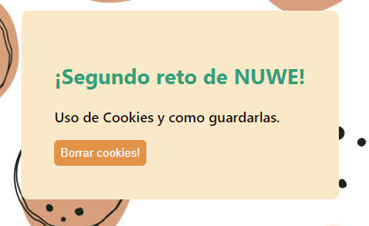

# Repte-2---Accept-Cookies


Comenzando 🚀
En este segundo reto el objetivo era hacer un pequeño ejemplo del uso de las cookies.

### Pre-requisitos 📋

No hace falta instalar o añadir nada.


## Código usado ⌨️
### Codificación 

_Como he accedido a las cookies_

```
document.cookie
```
He accedido directamente a cookie para darle un valor. En este caso solo he usado nombre de usuario, pero en proyectos reales nos darían mas tipos de valores. También especificar el "path" y el "expire" de las cookies según nos convenga.

### Maquetación y estilos

He diseñado una sencilla ventana modal que salta nada mas accerder a la web. La ventana desparece o bien aceptando las cookies, o cerrandola. En caso de aceptarlas, la ventana desaparecerá y no volverá a mostrarse en caso de refrescar la página.


He incorporado el boton de "Borrar cookies" para hacer mas fácil la verificación de los objetivos pedidos.



## Construido con 🛠️
HTML 
CSS
JS


⌨️ con ❤️ por MireiaBS 😊
